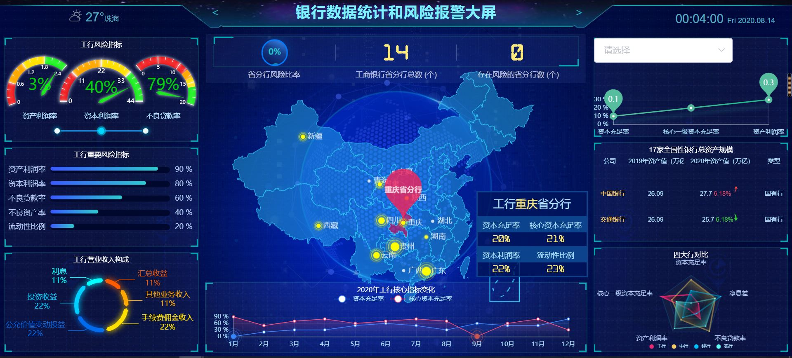
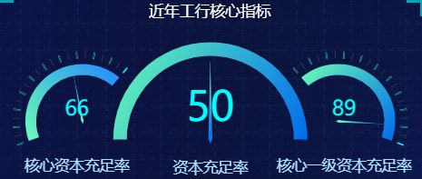
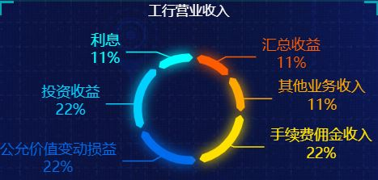
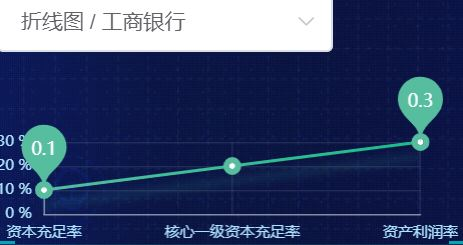
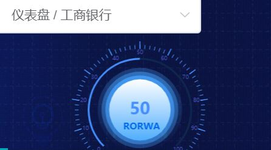
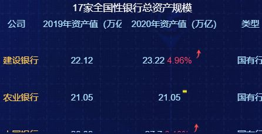

<h1>前端项目结构说明</h1>

<h2>目录结构</h2>

```javascript
src
│  App.vue					// 根组件
│  main.js					// 程序入口文件
│  README.md				// 结构说明
│  
├─assets
│  │  logo.png				// vue的logo
│  │  
│  ├─css 					//可能用到的css
│  │      swiper.min.css
│  │      visual.css
│  │      
│  ├─fonts					//导入的字体
│  │      DIGITALDREAMFAT.ttf
│  │      DIGITALDREAMFAT.woff
│  │      DIGITALDREAMFAT.woff2
│  │      yjsz.TTF
│  │      
│  ├─img
│  │  │  
│  │  ├─chart1				//可能用到的图片
│  │  │      
│  │  ├─chart2				//可能用到的图片
│  │  │      
│  │  ├─dynamic				//可能用到的图片
│  │  │      
│  │  └─screen_img			//Screen页面用到的图片
│  │          1.jpg			//背景图
│  │          head_bg.png	//页面头图
│  │          head_bg2.png	//页面头图
│  │          jt.png	 	//地球的边缘高亮图
│  │          lbx.png		//地球的边缘网结构图
│  │          lei.png		//雷天气图标
│  │          line.png		//组件边框的角
│  │          map.png		//地球图
│  │          qing.png		//晴天气图标
│  │          shachen.png	//沙尘天气图标
│  │          wu.png		//雾天气图标
│  │          xue.png		//雪天气图标
│  │          yin.png		//阴天气图标
│  │          yu.png		//雨天气图标
│  │          yun.png		//多云天气图标
│  │          
│  ├─js
│  │      request.js		//封装的请求类
│  │      utils.js			//封装的工具类
│  │      
│  └─styles
│          base.scss		//对浏览器的样式
│          common.scss		//公共样式
│          
├─components
│  │  index.js				//在此导入组件
│  │  
│  ├─colorfulRadar			//Home页面的雷达图组件
│  │      index.vue
│  │      
│  ├─dynamicLine			//Home页面的折线图组件
│  │      dynamicLine.vue
│  │      
│  ├─gauge					//Home页面的仪表盘组件
│  │      index.vue
│  │      
│  ├─HelloWorld				//根页面的初始vue项目界面
│  │      index.vue
│  │      
│  ├─leida					//Home页面的雷达图组件				
│  │      index.vue
│  │      
│  ├─ringPie				//Home页面的饼图组件
│  │      index.vue
│  │      
│  ├─Screen					//Screen页面的组件都在此
│  │      barChart.vue		//柱状图组件
│  │      dashboard.vue		//仪表盘组件
│  │      lineChart.vue		//折线图组件
│  │      list.vue			//列表组件
|  |      threeDashboards.vue //三雷达图组件
|  |      configChart.vue    //可配置组件
│  │      model.vue			//组件模型，可以复制内容稍做改动，来创建新组件
│  │      pieChart.vue		//饼图组件
│  │      radarChart.vue	//雷达图组件
│  │      waterSphereChart.vue	 //水球图组件
│  │      
│  └─seamless				//Home页面的动态信息组件
│          index.vue
│          
├─router					//路由，在此配置路径访问的页面
│      index.js
│      
├─store						//目前为空
│      index.js
│      
└─views						//两大页面
        Home.vue			//Home页面
        Screen.vue			//Screen页面
```

<h2>路径访问</h2>

访问Screen页面：

<http://localhost:8081/#/Screen>

<h2>界面展示</h2>

</img>

<h2>Screen页面html结构说明</h2>

</img>

</img>

<h2>风险指标</h2>

资本充足率=（核心资本+附属资本）/风险加权资产，不应低于8%

核心资本充足率=核心资本/风险加权资产，不应低于4%

资产利润率=税后净利润/平均资产总额*100%，不应低于0.6%

资本利润率=税后净利润/平均净资产*100%，不应低于11%

不良贷款率=不良贷款/贷款总额，不应高于5%

不良资产率=不良信用风险资产/信用风险资产总额 ，不应高于4%

流动性比例=流动性资产余额/流动性负债余额，不应低于25%

<h2>衡量银行的指标</h2>

风险加权资产收益率RORWA=归母净利润 / 期末风险加权资产 

<h2>数据图表定义说明</h2>

**三仪表盘**

表名：近年工行核心指标

值：资本充足率、核心资本充足率、核心一级资本充足率

轮播：2020年、2019年、2018年（未完成）

</img>

**柱状图**

表名：工行重要风险指标

X轴：比率

Y轴：各个风险指标

资产利润率、资本利润率、不良贷款率、不良资产率、流动性比例

</img>

**饼图**

表名：近年3年工行营业收入

分类：利息、投资收益、公允价值变动损益、汇总收益、手续费及佣金收入、其他业务收入

</img>

 

**折线图**

表名：2020年工行核心指标变化

X轴：今年的月份

Y轴：百分比

两条线：资本充足率与核心资本充足率

</img>

 

**雷达图**

表名：四大行对比

五个指标：资本充足率、核心一级资本充足率、资产利润率、不良贷款率、净息差

银行：工行、中行、建行、农行

</img>

 

**可配置 折线图**

 选项：工行、中行、建行、农行

 x轴：资本充足率、核心资本充足率、资产利润率

y轴：百分比

</img>


**可配置 雷达图**

 选项：工行、中行、建行、农行

 值：RORWA

</img>


**列表**

表名：17家全国性银行总资产规模

表头：公司、2019年资产值（万亿）、2020年资产值（万亿）、增幅、类型

</img>


<h1>后端项目提供的API</h1>

http://localhost:8088/GetData/{type}
示例：http://localhost:8088/GetData/Plane

<h4>其中{type}可选的值有：</h4>
> **Plane**仪表盘
> 返回JSON数据示例：

> [{"name":"核心资本充足率","value":14,"valuedate":"2020-01-01"},
> {"name":"核心资本充足率","value":13,"valuedate":"2019-01-01"},
> {"name":"核心资本充足率","value":13,"valuedate":"2018-01-01"},
> {"name":"资本充足率","value":17,"valuedate":"2020-01-01"},
> {"name":"资本充足率","value":15,"valuedate":"2019-01-01"},
> {"name":"资本充足率","value":15,"valuedate":"2018-01-01"},
> {"name":"核心一级资本充足率","value":13,"valuedate":"2020-01-01"},
> {"name":"核心一级资本充足率","value":13,"valuedate":"2019-01-01"},
> {"name":"核心一级资本充足率","value":13,"valuedate":"2018-01-01"}]

```
可视化数据：
+--------------------+-------+------------+
| NAME               | VALUE | valuedate  |
+--------------------+-------+------------+
| 核心资本充足率     | 14    | 2020-01-01 |
| 核心资本充足率     | 13    | 2019-01-01 |
| 核心资本充足率     | 13    | 2018-01-01 |
| 资本充足率         | 17    | 2020-01-01 |
| 资本充足率         | 15    | 2019-01-01 |
| 资本充足率         | 15    | 2018-01-01 |
| 核心一级资本充足率 | 13    | 2020-01-01 |
| 核心一级资本充足率 | 13    | 2019-01-01 |
| 核心一级资本充足率 | 13    | 2018-01-01 |
+--------------------+-------+------------+
```

> **Bar**柱状图
> 返回JSON数据示例：
> [{"name":"资产利润率","value":2},
> {"name":"资本利润率","value":13},
> {"name":"不良贷款率","value":1},
> {"name":"不良资产率","value":2},
> {"name":"流动性比例","value":35}

```
可视化数据：
+------------+-------+
| NAME       | VALUE |
+------------+-------+
| 资产利润率 | 2     |
| 资本利润率 | 13    |
| 不良贷款率 | 1     |
| 不良资产率 | 2     |
| 流动性比例 | 35    |
+------------+-------+
```

> **Pie**饼图
> 返回JSON数据示例：

> [{"name":"利息净收入","value":590260,"valuedate":"2020-01-01"},
> {"name":"利息净收入","value":570804,"valuedate":"2019-01-01"},
> {"name":"利息净收入","value":524616,"valuedate":"2018-01-01"},
> {"name":"投资收益","value":37772,"valuedate":"2020-01-01"},
> {"name":"投资收益","value":11324,"valuedate":"2019-01-01"},
> {"name":"投资收益","value":9492,"valuedate":"2018-01-01"},
> {"name":"公允价值变动收益","value":24828,"valuedate":"2020-01-01"},
> {"name":"公允价值变动收益","value":13372,"valuedate":"2019-01-01"},
> {"name":"公允价值变动收益","value":1308,"valuedate":"2018-01-01"},
> {"name":"汇兑及汇率产品净收益","value":13096,"valuedate":"2020-01-01"},
> {"name":"汇兑及汇率产品净收益","value":3520,"valuedate":"2019-01-01"},
> {"name":"汇兑及汇率产品净收益","value":8420,"valuedate":"2018-01-01"},
> {"name":"手续费及佣金收入","value":190752,"valuedate":"2020-01-01"},
> {"name":"手续费及佣金收入","value":194460,"valuedate":"2019-01-01"},
> {"name":"手续费及佣金收入","value":174252,"valuedate":"2018-01-01"},
> {"name":"其他业务收入","value":20160,"valuedate":"2020-01-01"},
> {"name":"其他业务收入","value":8508,"valuedate":"2019-01-01"},
> {"name":"其他业务收入","value":2540,"valuedate":"2018-01-01"}]

```
可视化数据：
+--------+----------------------+------------+
| VALUE  | NAME                 | valuedate  |
+--------+----------------------+------------+
| 590260 | 利息净收入           | 2020-01-01 |
| 570804 | 利息净收入           | 2019-01-01 |
| 524616 | 利息净收入           | 2018-01-01 |
|  37772 | 投资收益             | 2020-01-01 |
|  11324 | 投资收益             | 2019-01-01 |
|   9492 | 投资收益             | 2018-01-01 |
|  24828 | 公允价值变动收益     | 2020-01-01 |
|  13372 | 公允价值变动收益     | 2019-01-01 |
|   1308 | 公允价值变动收益     | 2018-01-01 |
|  13096 | 汇兑及汇率产品净收益 | 2020-01-01 |
|   3520 | 汇兑及汇率产品净收益 | 2019-01-01 |
|   8420 | 汇兑及汇率产品净收益 | 2018-01-01 |
| 190752 | 手续费及佣金收入     | 2020-01-01 |
| 194460 | 手续费及佣金收入     | 2019-01-01 |
| 174252 | 手续费及佣金收入     | 2018-01-01 |
|  20160 | 其他业务收入         | 2020-01-01 |
|   8508 | 其他业务收入         | 2019-01-01 |
|   2540 | 其他业务收入         | 2018-01-01 |
+--------+----------------------+------------+
```

> **Line**折线图
> JSON数据：

> [{"name":"利息净收入","value":590260,"valuedate":"2020-01-01"},
> {"name":"利息净收入","value":570804,"valuedate":"2019-01-01"},
> {"name":"利息净收入","value":524616,"valuedate":"2018-01-01"},
> {"name":"投资收益","value":37772,"valuedate":"2020-01-01"},
> {"name":"投资收益","value":11324,"valuedate":"2019-01-01"},
> {"name":"投资收益","value":9492,"valuedate":"2018-01-01"},
> {"name":"公允价值变动收益","value":24828,"valuedate":"2020-01-01"},
> {"name":"公允价值变动收益","value":13372,"valuedate":"2019-01-01"},
> {"name":"公允价值变动收益","value":1308,"valuedate":"2018-01-01"},
> {"name":"汇兑及汇率产品净收益","value":13096,"valuedate":"2020-01-01"},
> {"name":"汇兑及汇率产品净收益","value":3520,"valuedate":"2019-01-01"},
> {"name":"汇兑及汇率产品净收益","value":8420,"valuedate":"2018-01-01"},
> {"name":"手续费及佣金收入","value":190752,"valuedate":"2020-01-01"},
> {"name":"手续费及佣金收入","value":194460,"valuedate":"2019-01-01"},
> {"name":"手续费及佣金收入","value":174252,"valuedate":"2018-01-01"},
> {"name":"其他业务收入","value":20160,"valuedate":"2020-01-01"},
> {"name":"其他业务收入","value":8508,"valuedate":"2019-01-01"},
> {"name":"其他业务收入","value":2540,"valuedate":"2018-01-01"}]

```
可视化数据：
+----------------+-------+------------+
| NAME           | VALUE | valuedate  |
+----------------+-------+------------+
| 资本充足率     | 15    | 2020-01-01 |
| 资本充足率     | 15    | 2020-02-01 |
| 资本充足率     | 15    | 2020-03-01 |
| 资本充足率     | 15    | 2020-04-01 |
| 资本充足率     | 15    | 2020-05-01 |
| 资本充足率     | 15    | 2020-06-01 |
| 资本充足率     | 15    | 2020-07-01 |
| 资本充足率     | 16    | 2020-08-01 |
| 资本充足率     | 16    | 2020-09-01 |
| 资本充足率     | 15    | 2020-10-01 |
| 资本充足率     | 15    | 2020-11-01 |
| 资本充足率     | 15    | 2020-12-01 |
| 核心资本充足率 | 12    | 2020-01-01 |
| 核心资本充足率 | 13    | 2020-02-01 |
| 核心资本充足率 | 13    | 2020-03-01 |
| 核心资本充足率 | 12    | 2020-04-01 |
| 核心资本充足率 | 13    | 2020-05-01 |
| 核心资本充足率 | 13    | 2020-06-01 |
| 核心资本充足率 | 12    | 2020-07-01 |
| 核心资本充足率 | 13    | 2020-08-01 |
| 核心资本充足率 | 13    | 2020-09-01 |
| 核心资本充足率 | 13    | 2020-10-01 |
| 核心资本充足率 | 13    | 2020-11-01 |
| 核心资本充足率 | 13    | 2020-12-01 |
+----------------+-------+------------+
```

> **Rada**雷达图
> JSON数据：

> [{"bank":"工商银行","name":"资本充足率","value":17},
> {"bank":"农业银行","name":"资本充足率","value":16},
> {"bank":"建设银行","name":"资本充足率","value":18},
> {"bank":"中国银行","name":"资本充足率","value":16},
> {"bank":"工商银行","name":"核心一级资本充足率","value":13},
> {"bank":"农业银行","name":"核心一级资本充足率","value":11},
> {"bank":"建设银行","name":"核心一级资本充足率","value":14},
> {"bank":"中国银行","name":"核心一级资本充足率","value":11},
> {"bank":"工商银行","name":"不良贷款率","value":1},
> {"bank":"农业银行","name":"不良贷款率","value":1},
> {"bank":"建设银行","name":"不良贷款率","value":1},
> {"bank":"中国银行","name":"不良贷款率","value":1},
> {"bank":"工商银行","name":"净息差","value":2},
> {"bank":"农业银行","name":"净息差","value":2},
> {"bank":"建设银行","name":"净息差","value":2},
> {"bank":"中国银行","name":"净息差","value":2},
> {"bank":"工商银行","name":"资产利润率","value":2},
> {"bank":"农业银行","name":"资产利润率","value":2},
> {"bank":"建设银行","name":"资产利润率","value":2},
> {"bank":"中国银行","name":"资产利润率","value":2}]

```
可视化数据：
+--------------------+-------+----------+
| NAME               | VALUE | bank     |
+--------------------+-------+----------+
| 资本充足率         | 17    | 工商银行 |
| 资本充足率         | 16    | 农业银行 |
| 资本充足率         | 18    | 建设银行 |
| 资本充足率         | 16    | 中国银行 |
| 核心一级资本充足率 | 13    | 工商银行 |
| 核心一级资本充足率 | 11    | 农业银行 |
| 核心一级资本充足率 | 14    | 建设银行 |
| 核心一级资本充足率 | 11    | 中国银行 |
| 不良贷款率         | 1     | 工商银行 |
| 不良贷款率         | 1     | 农业银行 |
| 不良贷款率         | 1     | 建设银行 |
| 不良贷款率         | 1     | 中国银行 |
| 净息差             | 2     | 工商银行 |
| 净息差             | 2     | 农业银行 |
| 净息差             | 2     | 建设银行 |
| 净息差             | 2     | 中国银行 |
| 资产利润率         | 2     | 工商银行 |
| 资产利润率         | 2     | 农业银行 |
| 资产利润率         | 2     | 建设银行 |
| 资产利润率         | 2     | 中国银行 |
+--------------------+-------+----------+
```

> **CLine**可配置折线图
> JSON数据：

> [{"bank":"中国银行","name":"核心资本充足率","value":13},
> {"bank":"中国银行","name":"资产利润率","value":2},
> {"bank":"中国银行","name":"资本充足率","value":15},
> {"bank":"农业银行","name":"核心资本充足率","value":13},
> {"bank":"农业银行","name":"资产利润率","value":2},
> {"bank":"农业银行","name":"资本充足率","value":16},
> {"bank":"工商银行","name":"核心资本充足率","value":13},
> {"bank":"工商银行","name":"资产利润率","value":2},
> {"bank":"工商银行","name":"资本充足率","value":15},
> {"bank":"建设银行","name":"核心资本充足率","value":13},
> {"bank":"建设银行","name":"资产利润率","value":2},
> {"bank":"建设银行","name":"资本充足率","value":15}]

```
可视化数据：
+----------+----------------+-------+
| bank     | NAME           | value |
+----------+----------------+-------+
| 中国银行 | 核心资本充足率 | 13    |
| 中国银行 | 资产利润率     | 2     |
| 中国银行 | 资本充足率     | 15    |
| 农业银行 | 核心资本充足率 | 13    |
| 农业银行 | 资产利润率     | 2     |
| 农业银行 | 资本充足率     | 16    |
| 工商银行 | 核心资本充足率 | 13    |
| 工商银行 | 资产利润率     | 2     |
| 工商银行 | 资本充足率     | 15    |
| 建设银行 | 核心资本充足率 | 13    |
| 建设银行 | 资产利润率     | 2     |
| 建设银行 | 资本充足率     | 15    |
+----------+----------------+-------+
```

> **CRada**可配置雷达图
> 返回JSON数据示例：

> [{"name":"工商银行","value":2},
> {"name":"农业银行","value":1},
> {"name":"建设银行","value":2},
> {"name":"中国银行","value":1}]

```
可视化数据：
+----------+-------+
| NAME     | value |
+----------+-------+
| 工商银行 | 2     |
| 农业银行 | 1     |
| 建设银行 | 2     |
| 中国银行 | 1     |
+----------+-------+
```

> **MList**列表
> 返回JSON数据：

> [{"bank":"工商银行","growth_rate":9,"total_assets_2019":27699540,"total_assets_2020":30109436,"type":"国有行"},
> {"bank":"农业银行","growth_rate":10,"total_assets_2019":22609471,"total_assets_2020":24878288,"type":"国有行"},
> {"bank":"建设银行","growth_rate":10,"total_assets_2019":23222693,"total_assets_2020":25436261,"type":"国有行"},
> {"bank":"中国银行","growth_rate":7,"total_assets_2019":21267275,"total_assets_2020":22769744,"type":"国有行"},
> {"bank":"交通银行","growth_rate":4,"total_assets_2019":9531171,"total_assets_2020":9905600,"type":"国有行"},
> {"bank":"邮储银行","growth_rate":7,"total_assets_2019":9516211,"total_assets_2020":10216706,"type":"国有行"},
> {"bank":"招商银行","growth_rate":10,"total_assets_2019":6745729,"total_assets_2020":7417240,"type":"股份行"},
> {"bank":"兴业银行","growth_rate":6,"total_assets_2019":6711657,"total_assets_2020":7145681,"type":"股份行"},
> {"bank":"浦发银行","growth_rate":11,"total_assets_2019":6289606,"total_assets_2020":7005929,"type":"股份行"},
> {"bank":"中信银行","growth_rate":11,"total_assets_2019":6066714,"total_assets_2020":6750433,"type":"股份行"},
> {"bank":"民生银行","growth_rate":11,"total_assets_2019":5994822,"total_assets_2020":6681841,"type":"股份行"},
> {"bank":"光大银行","growth_rate":9,"total_assets_2019":4357332,"total_assets_2020":4733431,"type":"股份行"},
> {"bank":"平安银行","growth_rate":15,"total_assets_2019":3418592,"total_assets_2020":3939070,"type":"股份行"},
> {"bank":"华夏银行","growth_rate":13,"total_assets_2019":2680580,"total_assets_2020":3020789,"type":"股份行"},
> {"bank":"广发银行","growth_rate":12,"total_assets_2019":2360850,"total_assets_2020":2632797,"type":"股份行"},
> {"bank":"浙商银行","growth_rate":9,"total_assets_2019":1646694,"total_assets_2020":1800785,"type":"股份行"},
> {"bank":"渤海银行","growth_rate":9,"total_assets_2019":1034451,"total_assets_2020":1113116,"type":"股份行"}]

```
可视化数据：
+----------+-------------+-------------------+-------------------+--------+
| bank     | growth_rate | total_assets_2019 | total_assets_2020 | type   |
+----------+-------------+-------------------+-------------------+--------+
| 工商银行 | 9           |          27699540 |          30109436 | 国有行 |
| 农业银行 | 10          |          22609471 |          24878288 | 国有行 |
| 建设银行 | 10          |          23222693 |          25436261 | 国有行 |
| 中国银行 | 7           |          21267275 |          22769744 | 国有行 |
| 交通银行 | 4           |           9531171 |           9905600 | 国有行 |
| 邮储银行 | 7           |           9516211 |          10216706 | 国有行 |
| 招商银行 | 10          |           6745729 |           7417240 | 股份行 |
| 兴业银行 | 6           |           6711657 |           7145681 | 股份行 |
| 浦发银行 | 11          |           6289606 |           7005929 | 股份行 |
| 中信银行 | 11          |           6066714 |           6750433 | 股份行 |
| 民生银行 | 11          |           5994822 |           6681841 | 股份行 |
| 光大银行 | 9           |           4357332 |           4733431 | 股份行 |
| 平安银行 | 15          |           3418592 |           3939070 | 股份行 |
| 华夏银行 | 13          |           2680580 |           3020789 | 股份行 |
| 广发银行 | 12          |           2360850 |           2632797 | 股份行 |
| 浙商银行 | 9           |           1646694 |           1800785 | 股份行 |
| 渤海银行 | 9           |           1034451 |           1113116 | 股份行 |
+----------+-------------+-------------------+-------------------+--------+
```

> **MMap**地图
>
> 返回JSON数据：

> [{"ckye":604675,"ckyetbzzl":8,"jylr":15635,"jylrtbzzl":9,"province":"安徽分行"},{"ckye":701586,"ckyetbzzl":7,"jylr":12058,"jylrtbzzl":8,"province":"北京分行"},{"ckye":586147,"ckyetbzzl":7,"jylr":10512,"jylrtbzzl":8,"province":"重庆分行"},{"ckye":562153,"ckyetbzzl":8,"jylr":9751,"jylrtbzzl":9,"province":"大连分行"},{"ckye":589982,"ckyetbzzl":8,"jylr":15874,"jylrtbzzl":11,"province":"福建分行"},{"ckye":562471,"ckyetbzzl":9,"jylr":16987,"jylrtbzzl":9,"province":"甘肃分行"},{"ckye":658976,"ckyetbzzl":6,"jylr":17886,"jylrtbzzl":8,"province":"广东分行"},{"ckye":548960,"ckyetbzzl":8,"jylr":15221,"jylrtbzzl":8,"province":"广西分行"},{"ckye":542896,"ckyetbzzl":7,"jylr":14287,"jylrtbzzl":8,"province":"贵州分行"},{"ckye":501896,"ckyetbzzl":7,"jylr":11587,"jylrtbzzl":7,"province":"海南分行"},{"ckye":608517,"ckyetbzzl":8,"jylr":14982,"jylrtbzzl":8,"province":"河北分行"},{"ckye":615823,"ckyetbzzl":9,"jylr":14269,"jylrtbzzl":8,"province":"河南分行"},{"ckye":574263,"ckyetbzzl":9,"jylr":13985,"jylrtbzzl":8,"province":"黑龙江分行"},{"ckye":638971,"ckyetbzzl":9,"jylr":15428,"jylrtbzzl":7,"province":"湖北分行"},{"ckye":645210,"ckyetbzzl":8,"jylr":15426,"jylrtbzzl":8,"province":"湖南分行"},{"ckye":561246,"ckyetbzzl":7,"jylr":13295,"jylrtbzzl":9,"province":"吉林分行"},{"ckye":725913,"ckyetbzzl":8,"jylr":16888,"jylrtbzzl":8,"province":"江苏分行"},{"ckye":621863,"ckyetbzzl":7,"jylr":13515,"jylrtbzzl":7,"province":"江西分行"},{"ckye":574261,"ckyetbzzl":6,"jylr":13562,"jylrtbzzl":7,"province":"辽宁分行"},{"ckye":506329,"ckyetbzzl":7,"jylr":12417,"jylrtbzzl":7,"province":"内蒙古分行"},{"ckye":512358,"ckyetbzzl":7,"jylr":7850,"jylrtbzzl":7,"province":"宁波分行"},{"ckye":536952,"ckyetbzzl":8,"jylr":12598,"jylrtbzzl":8,"province":"宁夏分行"},{"ckye":496521,"ckyetbzzl":8,"jylr":8951,"jylrtbzzl":7,"province":"青岛分行"},{"ckye":532610,"ckyetbzzl":9,"jylr":13587,"jylrtbzzl":7,"province":"青海分行"},{"ckye":625417,"ckyetbzzl":8,"jylr":14826,"jylrtbzzl":9,"province":"山东分行"},{"ckye":602043,"ckyetbzzl":7,"jylr":14375,"jylrtbzzl":8,"province":"山西分行"},{"ckye":578624,"ckyetbzzl":7,"jylr":15694,"jylrtbzzl":7,"province":"陕西分行"},{"ckye":725631,"ckyetbzzl":7,"jylr":12384,"jylrtbzzl":9,"province":"上海分行"},{"ckye":698210,"ckyetbzzl":9,"jylr":16018,"jylrtbzzl":10,"province":"深圳分行"},{"ckye":623427,"ckyetbzzl":7,"jylr":15403,"jylrtbzzl":9,"province":"四川分行"},{"ckye":587624,"ckyetbzzl":8,"jylr":10062,"jylrtbzzl":7,"province":"苏州分行"},{"ckye":503091,"ckyetbzzl":8,"jylr":9018,"jylrtbzzl":8,"province":"天津分行"},{"ckye":498624,"ckyetbzzl":6,"jylr":12351,"jylrtbzzl":5,"province":"西藏分行"},{"ckye":532689,"ckyetbzzl":8,"jylr":9541,"jylrtbzzl":7,"province":"厦门分行"},{"ckye":528410,"ckyetbzzl":6,"jylr":11876,"jylrtbzzl":6,"province":"新疆分行"},{"ckye":556129,"ckyetbzzl":8,"jylr":12409,"jylrtbzzl":7,"province":"云南分行"},{"ckye":678960,"ckyetbzzl":9,"jylr":16875,"jylrtbzzl":9,"province":"浙江分行"}]

```
可视化数据：
+------------+-------+-----------+--------+-----------+
| province   | jylr  | jylrtbzzl | ckye   | ckyetbzzl |
+------------+-------+-----------+--------+-----------+
| 安徽分行   | 15635 | 9         | 604675 | 8         |
| 北京分行   | 12058 | 8         | 701586 | 7         |
| 重庆分行   | 10512 | 8         | 586147 | 7         |
| 大连分行   |  9751 | 9         | 562153 | 8         |
| 福建分行   | 15874 | 11        | 589982 | 8         |
| 甘肃分行   | 16987 | 9         | 562471 | 9         |
| 广东分行   | 17886 | 8         | 658976 | 6         |
| 广西分行   | 15221 | 8         | 548960 | 8         |
| 贵州分行   | 14287 | 8         | 542896 | 7         |
| 海南分行   | 11587 | 7         | 501896 | 7         |
| 河北分行   | 14982 | 8         | 608517 | 8         |
| 河南分行   | 14269 | 8         | 615823 | 9         |
| 黑龙江分行 | 13985 | 8         | 574263 | 9         |
| 湖北分行   | 15428 | 7         | 638971 | 9         |
| 湖南分行   | 15426 | 8         | 645210 | 8         |
| 吉林分行   | 13295 | 9         | 561246 | 7         |
| 江苏分行   | 16888 | 8         | 725913 | 8         |
| 江西分行   | 13515 | 7         | 621863 | 7         |
| 辽宁分行   | 13562 | 7         | 574261 | 6         |
| 内蒙古分行 | 12417 | 7         | 506329 | 7         |
| 宁波分行   |  7850 | 7         | 512358 | 7         |
| 宁夏分行   | 12598 | 8         | 536952 | 8         |
| 青岛分行   |  8951 | 7         | 496521 | 8         |
| 青海分行   | 13587 | 7         | 532610 | 9         |
| 山东分行   | 14826 | 9         | 625417 | 8         |
| 山西分行   | 14375 | 8         | 602043 | 7         |
| 陕西分行   | 15694 | 7         | 578624 | 7         |
| 上海分行   | 12384 | 9         | 725631 | 7         |
| 深圳分行   | 16018 | 10        | 698210 | 9         |
| 四川分行   | 15403 | 9         | 623427 | 7         |
| 苏州分行   | 10062 | 7         | 587624 | 8         |
| 天津分行   |  9018 | 8         | 503091 | 8         |
| 西藏分行   | 12351 | 5         | 498624 | 6         |
| 厦门分行   |  9541 | 7         | 532689 | 8         |
| 新疆分行   | 11876 | 6         | 528410 | 6         |
| 云南分行   | 12409 | 7         | 556129 | 8         |
| 浙江分行   | 16875 | 9         | 678960 | 9         |
+------------+-------+-----------+--------+-----------+
```

