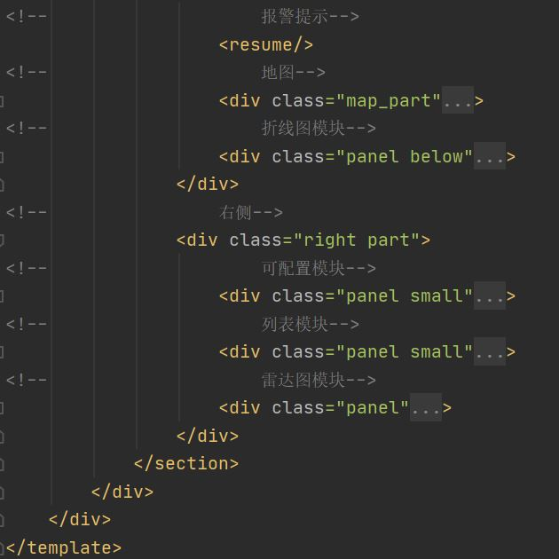

<h1>前端项目结构说明</h1>

<h2>部分图表说明：</h2>

1. 9个风险指标的阈值列表储存在 store/modules/risk.js，可以在组件访问;

   仪表盘、柱状图、折线图都可以从后端传输的数据和risk.js的阈值列表中，得到它们所需的阈值列表，并作告警;

   阈值列表中负值表示指标不能大于该值，正值表示指标不能小于该值;

2. 仪表盘可替换数据，但是必须要4个，每个只展示一个指标数据，指标阈值可正可负

   所需数据格式为:

   [{name:"xx",value:xx},...,]

3. 柱状图可替换数据，长度不限，指标阈值可正可负

   所需数据格式为:

   [{name:"xx",value:xx},...,]

4. 折线图可替换数据，但只能是两个指标（两条线），指标阈值只能为正

   所需数据格式为:

   [{name:"x1",value:xx,valuedate:"xx"},...,{name:"x2",value:xx,valuedate:"xx"},...]

5. 地图不可替换数据，指标名写死，长度不限

   所需数据格式为:[{hxfzycd:xx,hxyjzbczl:xx,hxzbczl:xx,province:xx,zbczl:xx}]

6. 报警部分共享地图的store，分行总数为store数据的长度

7. 列表可替换数据，不限长度

   所需数据格式为:

   [{company:"xx",hxfzycd:xx,hxzbczl:xx,zbczl:xx},..]

8. 雷达图可替换数据，但只能是5个指标和4个银行；每个指标的最大值设置为所有银行在这一指标上的最大值；

   所需数据格式为:

   [{bank:"x1行",name:"y1率",value:xx},

   {bank:"x2行",name:"y1率",value:xx},

   {bank:"x1行",name:"y2率",value:xx},

   {bank:"x2行",name:"y2率",value:xx},]


<h2>目录结构</h2>

```javascript
src
│  App.vue					// 根组件
│  main.js					// 程序入口文件
│  README.md				// 结构说明
│  
├─assets
│  │  logo.png				// vue的logo
│  │  
│  ├─css 					//可能用到的css
│  │      swiper.min.css
│  │      visual.css
│  │      
│  ├─fonts					//导入的字体
│  │      DIGITALDREAMFAT.ttf
│  │      DIGITALDREAMFAT.woff
│  │      DIGITALDREAMFAT.woff2
│  │      yjsz.TTF
│  │      
│  ├─img
│  │  │  
│  │  ├─chart1				//可能用到的图片
│  │  │      
│  │  ├─chart2				//可能用到的图片
│  │  │      
│  │  ├─dynamic				//可能用到的图片
│  │  │      
│  │  └─screen_img			//Screen页面用到的图片
│  │          1.jpg			//背景图
│  │          head_bg.png	//页面头图
│  │          head_bg2.png	//页面头图
│  │          jt.png	 	//地球的边缘高亮图
│  │          lbx.png		//地球的边缘网结构图
│  │          lei.png		//雷天气图标
│  │          line.png		//组件边框的角
│  │          map.png		//地球图
│  │          qing.png		//晴天气图标
│  │          shachen.png	//沙尘天气图标
│  │          wu.png		//雾天气图标
│  │          xue.png		//雪天气图标
│  │          yin.png		//阴天气图标
│  │          yu.png		//雨天气图标
│  │          yun.png		//多云天气图标
│  │          
│  ├─js
│  │      request.js		//封装的请求类
│  │      utils.js			//封装的工具类
│  │      
│  └─styles
│          base.scss		//对浏览器的样式
│          common.scss		//公共样式
│          
├─components
│  │  index.js				//在此导入组件
│  │  
│  ├─colorfulRadar			//Home页面的雷达图组件
│  │      index.vue
│  │      
│  ├─dynamicLine			//Home页面的折线图组件
│  │      dynamicLine.vue
│  │      
│  ├─gauge					//Home页面的仪表盘组件
│  │      index.vue
│  │      
│  ├─HelloWorld				//根页面的初始vue项目界面
│  │      index.vue
│  │      
│  ├─leida					//Home页面的雷达图组件				
│  │      index.vue
│  │      
│  ├─ringPie				//Home页面的饼图组件
│  │      index.vue
│  │      
│  ├─Screen					//Screen页面的组件都在此
│  │      barChart.vue		//柱状图组件
│  │      dashboard.vue		//仪表盘组件
│  │      lineChart.vue		//折线图组件
│  │      list.vue			//列表组件
|  |      threeDashboards.vue //三雷达图组件
|  |      configChart.vue    //可配置组件
│  │      resume.vue			//报警部分组件
│  │      pieChart.vue		//饼图组件
|  |      pieChart1.vue     //饼图组件（纯前端）
│  │      radarChart.vue	//雷达图组件
│  │      waterSphereChart.vue	 //水球图组件
│  │      mapChart.vue     //地图组件
│  │      
│  └─seamless				//Home页面的动态信息组件
│          index.vue
│          
├─router					//路由，在此配置路径访问的页面
│      index.js
│      
├─store						//目前为空
│      index.js
│      
└─views						//两大页面
        Home.vue			//Home页面
        Screen.vue			//Screen页面
```

<h2>路径访问</h2>

访问Screen页面：

<http://localhost:8081/#/Screen>

<h2>界面展示</h2>

</img>

<h2>Screen页面html结构说明</h2>

</img>

</img>

<h2>风险指标</h2>

资本充足率=（核心资本+附属资本）/风险加权资产，不应低于8%

核心资本充足率=核心资本/风险加权资产，不应低于4%

核心一级资本充足率，不低于5%

资产利润率=税后净利润/平均资产总额*100%，不应低于0.6%

资本利润率=税后净利润/平均净资产*100%，不应低于11%

不良贷款率=不良贷款/贷款总额，不应高于5%

不良资产率=不良信用风险资产/信用风险资产总额 ，不应高于4%

流动性比例=流动性资产余额/流动性负债余额，不应低于25%

<span style="color:red">核心负债依存度=核心负债/总负债，不应低于60%（新增）</span>

<h2>衡量银行的指标</h2>

风险加权资产收益率RORWA=归母净利润 / 期末风险加权资产 

<h2>数据图表定义说明</h2>

<h3>修改</h3>

<hr></hr>

**仪表盘**

表名：工行重要风险指标

值：

资本充足率、核心资本充足率、核心一级资本充足率、核心负债依存度

<span style="color:red">风险提示：已经按各个指标的阈值，设置了风险提示<br>即：当低于阈值时指针和百分比变为红色</span>

轮播：每个页面一个仪表盘，显示一个指标。共轮播4次

**柱状图**

表名：工行重要风险指标

X轴：比率（默认2020年平均值）

Y轴：5个风险指标

资产利润率、资本利润率、不良贷款率、不良资产率、流动性比例

**雷达图**

表名：四大行风险指标对比

五个指标：资本充足率、核心资本充足率、核心一级资本充足率、核心负债依存度、流动性比例

银行：工行、中行、建行、农行

**地图**

数据：全国省分行所在省份名

4个指标：资本充足率、核心资本充足率、核心一级资本充足率、核心负债依存度

<span style="color:red">在组件data域的data为每个省份定义了value，表明当前省分行有多少个指标有风险（共展示的4个），如风险报警不使用，可无视</span>

</img>

</img>

**列表**

表名：17家全国性银行重要指标

表头：公司、资本充足率、核心资本充足率、核心负债依存度

<hr>

<h3>未修改</h3>

**饼图**

表名：工行营业收入构成

分类：利息、投资收益、公允价值变动损益、汇总收益、手续费及佣金收入、其他业务收入

</img>

**报警模块**

水球图：省分行风险比率<span style="color:red">（已与下面两个参数绑定）</span>

​		=存在风险的省分行数/工商银行省分行总数

参数：工商银行省分行总数、存在风险的省分行数

</img>

**折线图**

表名：2020年工行核心指标变化

X轴：今年的月份

Y轴：百分比

两条线：资本充足率与核心资本充足率

</img>

**可配置 折线图**

 选项：工行、中行、建行、农行

 x轴：资本充足率、核心资本充足率、资产利润率

y轴：百分比

</img>

**可配置 雷达图**

 选项：工行、中行、建行、农行

 值：RORWA

</img>


<h1>后端项目提供的API</h1>

http://localhost:8088/GetData/{type}
示例：http://localhost:8088/GetData/Plane

<h4>其中{type}可选的值有：</h4>
> **Plane**仪表盘
> 返回JSON数据示例：

> [{"name":"资本充足率","value":16.77},
>
> {"name":"核心一级资本充足率","value":13.2},
>
> {"name":"核心资本充足率","value":3.88},
>
> {"name":"核心负债依存度","value":67.85}]

```
可视化数据：
+--------------------+-------+
| NAME               | VALUE |
+--------------------+-------+
| 资本充足率         | 16.77 |
| 核心一级资本充足率 | 13.2  |
| 核心资本充足率     | 3.88  |
| 核心负债依存度     | 67.85 |
+--------------------+-------+
```

> **Bar**柱状图
> 返回JSON数据示例：
> [{"name":"资产利润率","value":1.75},
>
> {"name":"资本利润率","value":12.56},
>
> {"name":"不良贷款率","value":-1.43},
>
> {"name":"流动性比例","value":35.2},
>
> {"name":"不良资产率","value":-1.58}]

```
可视化数据：
+------------+-------+
| NAME       | VALUE |
+------------+-------+
| 资产利润率 | 1.75  |
| 资本利润率 | 12.56 |
| 不良贷款率 | -1.43 |
| 流动性比例 | 35.2  |
| 不良资产率 | -1.58 |
+------------+-------+
```

> **Pie**饼图
> 返回JSON数据示例：

> [{"name":"利息净收入","value":590260},
> 
> {"name":"投资收益","value":37772},
> 
> {"name":"公允价值变动收益","value":24828},
> 
> {"name":"汇兑及汇率产品净收益","value":13096},
> 
> {"name":"手续费及佣金收入","value":190752},
> 
> {"name":"其他业务收入","value":20160}]

```
可视化数据：
+----------------------+--------+
| NAME                 | VALUE  |
+----------------------+--------+
| 利息净收入           | 590260 |
| 投资收益             |  37772 |
| 公允价值变动收益     |  24828 |
| 汇兑及汇率产品净收益 |  13096 |
| 手续费及佣金收入     | 190752 |
| 其他业务收入         |  20160 |
+----------------------+--------+
```

> **Line**折线图
> JSON数据：

> [{"name":"资本充足率","value":14.6,"valuedate":"2020-01-01"},
>
> {"name":"资本充足率","value":14.9,"valuedate":"2020-02-01"},
>
> {"name":"资本充足率","value":15.1,"valuedate":"2020-03-01"},
>
> {"name":"资本充足率","value":15.3,"valuedate":"2020-04-01"},
>
> {"name":"资本充足率","value":15.5,"valuedate":"2020-05-01"},
>
> {"name":"资本充足率","value":15.3,"valuedate":"2020-06-01"},
>
> {"name":"资本充足率","value":14.6,"valuedate":"2020-07-01"},
>
> {"name":"资本充足率","value":15.7,"valuedate":"2020-08-01"},
>
> {"name":"资本充足率","value":16.0,"valuedate":"2020-09-01"},
>
> {"name":"资本充足率","value":15.5,"valuedate":"2020-10-01"},
>
> {"name":"资本充足率","value":15.0,"valuedate":"2020-11-01"},
>
> {"name":"资本充足率","value":15.5,"valuedate":"2020-12-01"},
>
> {"name":"核心资本充足率","value":12.3,"valuedate":"2020-01-01"},
>
> {"name":"核心资本充足率","value":12.6,"valuedate":"2020-02-01"},
>
> {"name":"核心资本充足率","value":12.7,"valuedate":"2020-03-01"},
>
> {"name":"核心资本充足率","value":12.4,"valuedate":"2020-04-01"},
>
> {"name":"核心资本充足率","value":12.9,"valuedate":"2020-05-01"},
>
> {"name":"核心资本充足率","value":12.6,"valuedate":"2020-06-01"},
>
> {"name":"核心资本充足率","value":12.4,"valuedate":"2020-07-01"},
>
> {"name":"核心资本充足率","value":12.7,"valuedate":"2020-08-01"},
>
> {"name":"核心资本充足率","value":13.1,"valuedate":"2020-09-01"},
>
> {"name":"核心资本充足率","value":12.8,"valuedate":"2020-10-01"},
>
> {"name":"核心资本充足率","value":12.9,"valuedate":"2020-11-01"},
>
> {"name":"核心资本充足率","value":13.2,"valuedate":"2020-12-01"}]

```
可视化数据：
+----------------+-------+------------+
| NAME           | VALUE | valuedate  |
+----------------+-------+------------+
| 资本充足率     | 14.6  | 2020-01-01 |
| 资本充足率     | 14.9  | 2020-02-01 |
| 资本充足率     | 15.1  | 2020-03-01 |
| 资本充足率     | 15.3  | 2020-04-01 |
| 资本充足率     | 15.5  | 2020-05-01 |
| 资本充足率     | 15.3  | 2020-06-01 |
| 资本充足率     | 14.6  | 2020-07-01 |
| 资本充足率     | 15.7  | 2020-08-01 |
| 资本充足率     | 16    | 2020-09-01 |
| 资本充足率     | 15.5  | 2020-10-01 |
| 资本充足率     | 15    | 2020-11-01 |
| 资本充足率     | 15.5  | 2020-12-01 |
| 核心资本充足率 | 12.3  | 2020-01-01 |
| 核心资本充足率 | 12.6  | 2020-02-01 |
| 核心资本充足率 | 12.7  | 2020-03-01 |
| 核心资本充足率 | 12.4  | 2020-04-01 |
| 核心资本充足率 | 12.9  | 2020-05-01 |
| 核心资本充足率 | 12.6  | 2020-06-01 |
| 核心资本充足率 | 12.4  | 2020-07-01 |
| 核心资本充足率 | 12.7  | 2020-08-01 |
| 核心资本充足率 | 13.1  | 2020-09-01 |
| 核心资本充足率 | 12.8  | 2020-10-01 |
| 核心资本充足率 | 12.9  | 2020-11-01 |
| 核心资本充足率 | 13.2  | 2020-12-01 |
+----------------+-------+------------+
```

> **Rada**雷达图
> JSON数据：

> [{"bank":"工商银行","name":"资本充足率","value":17},
>
> {"bank":"工商银行","name":"核心一级资本充足率","value":13},
>
> {"bank":"农业银行","name":"资本充足率","value":16},
>
> {"bank":"农业银行","name":"核心一级资本充足率","value":11},
>
> {"bank":"建设银行","name":"资本充足率","value":18},
>
> {"bank":"建设银行","name":"核心一级资本充足率","value":14},
>
> {"bank":"中国银行","name":"资本充足率","value":16},
>
> {"bank":"中国银行","name":"核心一级资本充足率","value":11},
>
> {"bank":"工商银行","name":"核心资本充足率","value":6},
>
> {"bank":"农业银行","name":"核心资本充足率","value":7},
>
> {"bank":"建设银行","name":"核心资本充足率","value":7},
>
> {"bank":"中国银行","name":"核心资本充足率","value":3},
>
> {"bank":"工商银行","name":"流动性比例","value":30},
>
> {"bank":"农业银行","name":"流动性比例","value":33},
>
> {"bank":"建设银行","name":"流动性比例","value":27},
>
> {"bank":"中国银行","name":"流动性比例","value":27},
>
> {"bank":"工商银行","name":"核心负债依存度","value":67},
>
> {"bank":"农业银行","name":"核心负债依存度","value":70},
>
> {"bank":"建设银行","name":"核心负债依存度","value":62},
>
> {"bank":"中国银行","name":"核心负债依存度","value":73}]

```
可视化数据：
+--------------------+-------+----------+
| NAME               | VALUE | bank     |
+--------------------+-------+----------+
| 资本充足率         | 17    | 工商银行 |
| 核心一级资本充足率 | 13    | 工商银行 |
| 资本充足率         | 16    | 农业银行 |
| 核心一级资本充足率 | 11    | 农业银行 |
| 资本充足率         | 18    | 建设银行 |
| 核心一级资本充足率 | 14    | 建设银行 |
| 资本充足率         | 16    | 中国银行 |
| 核心一级资本充足率 | 11    | 中国银行 |
| 核心资本充足率     | 6     | 工商银行 |
| 核心资本充足率     | 7     | 农业银行 |
| 核心资本充足率     | 7     | 建设银行 |
| 核心资本充足率     | 3     | 中国银行 |
| 流动性比例         | 30    | 工商银行 |
| 流动性比例         | 33    | 农业银行 |
| 流动性比例         | 27    | 建设银行 |
| 流动性比例         | 27    | 中国银行 |
| 核心负债依存度     | 67    | 工商银行 |
| 核心负债依存度     | 70    | 农业银行 |
| 核心负债依存度     | 62    | 建设银行 |
| 核心负债依存度     | 73    | 中国银行 |
+--------------------+-------+----------+
```


> **ConfigData**可配置图表
>
> 返回JSON数据示例：

> [{"name":"资本充足率","time":"第一季度","value":11.8},
>
> {"name":"核心资本充足率","time":"第一季度","value":9.4},
>
> {"name":"核心一级资本充足率","time":"第一季度","value":9.87},
>
> {"name":"资产利润率","time":"第一季度","value":2.03},
>
> {"name":"资本利润率","time":"第一季度","value":16.3},
>
> {"name":"不良贷款率","time":"第一季度","value":1.89},
>
> {"name":"不良资产率","time":"第一季度","value":1.65},
>
> {"name":"流动性比例","time":"第一季度","value":29.73},
>
> {"name":"核心负债依存度","time":"第一季度","value":66.93},
>
> {"name":"RORWA","time":"第一季度","value":1.55},
>
> {"name":"资本充足率","time":"第二季度","value":11.16},
>
> {"name":"核心资本充足率","time":"第二季度","value":5.46},
>
> {"name":"核心一级资本充足率","time":"第二季度","value":5.1},
>
> {"name":"资产利润率","time":"第二季度","value":1.26},
>
> {"name":"资本利润率","time":"第二季度","value":14.3},
>
> {"name":"不良贷款率","time":"第二季度","value":2.2},
>
> {"name":"不良资产率","time":"第二季度","value":1.95},
>
> {"name":"流动性比例","time":"第二季度","value":29.44},
>
> {"name":"核心负债依存度","time":"第二季度","value":61.83},
>
> {"name":"RORWA","time":"第二季度","value":1.89},
>
> {"name":"资本充足率","time":"第三季度","value":13.92},
>
> {"name":"核心资本充足率","time":"第三季度","value":5.08},
>
> {"name":"核心一级资本充足率","time":"第三季度","value":9.26},
>
> {"name":"资产利润率","time":"第三季度","value":2.59},
>
> {"name":"资本利润率","time":"第三季度","value":14.26},
>
> {"name":"不良贷款率","time":"第三季度","value":1.6},
>
> {"name":"不良资产率","time":"第三季度","value":1.35},
>
> {"name":"流动性比例","time":"第三季度","value":26.47},
>
> {"name":"核心负债依存度","time":"第三季度","value":64.16},
>
> {"name":"RORWA","time":"第三季度","value":1.27},
>
> {"name":"资本充足率","time":"第四季度","value":10.93},
>
> {"name":"核心资本充足率","time":"第四季度","value":6.9},
>
> {"name":"核心一级资本充足率","time":"第四季度","value":5.78},
>
> {"name":"资产利润率","time":"第四季度","value":2.37},
>
> {"name":"资本利润率","time":"第四季度","value":12.99},
>
> {"name":"不良贷款率","time":"第四季度","value":1.23},
>
> {"name":"不良资产率","time":"第四季度","value":1.42},
>
> {"name":"流动性比例","time":"第四季度","value":30.52},
>
> {"name":"核心负债依存度","time":"第四季度","value":64.02},
>
> {"name":"RORWA","time":"第四季度","value":1.96}]

```
可视化数据：
+--------------------+-------+----------+
| NAME               | value | time     |
+--------------------+-------+----------+
| 资本充足率         |  11.8 | 第一季度 |
| 核心资本充足率     |   9.4 | 第一季度 |
| 核心一级资本充足率 |  9.87 | 第一季度 |
| 资产利润率         |  2.03 | 第一季度 |
| 资本利润率         |  16.3 | 第一季度 |
| 不良贷款率         |  1.89 | 第一季度 |
| 不良资产率         |  1.65 | 第一季度 |
| 流动性比例         | 29.73 | 第一季度 |
| 核心负债依存度     | 66.93 | 第一季度 |
| RORWA              |  1.55 | 第一季度 |
| 资本充足率         | 11.16 | 第二季度 |
| 核心资本充足率     |  5.46 | 第二季度 |
| 核心一级资本充足率 |   5.1 | 第二季度 |
| 资产利润率         |  1.26 | 第二季度 |
| 资本利润率         |  14.3 | 第二季度 |
| 不良贷款率         |   2.2 | 第二季度 |
| 不良资产率         |  1.95 | 第二季度 |
| 流动性比例         | 29.44 | 第二季度 |
| 核心负债依存度     | 61.83 | 第二季度 |
| RORWA              |  1.89 | 第二季度 |
| 资本充足率         | 13.92 | 第三季度 |
| 核心资本充足率     |  5.08 | 第三季度 |
| 核心一级资本充足率 |  9.26 | 第三季度 |
| 资产利润率         |  2.59 | 第三季度 |
| 资本利润率         | 14.26 | 第三季度 |
| 不良贷款率         |   1.6 | 第三季度 |
| 不良资产率         |  1.35 | 第三季度 |
| 流动性比例         | 26.47 | 第三季度 |
| 核心负债依存度     | 64.16 | 第三季度 |
| RORWA              |  1.27 | 第三季度 |
| 资本充足率         | 10.93 | 第四季度 |
| 核心资本充足率     |   6.9 | 第四季度 |
| 核心一级资本充足率 |  5.78 | 第四季度 |
| 资产利润率         |  2.37 | 第四季度 |
| 资本利润率         | 12.99 | 第四季度 |
| 不良贷款率         |  1.23 | 第四季度 |
| 不良资产率         |  1.42 | 第四季度 |
| 流动性比例         | 30.52 | 第四季度 |
| 核心负债依存度     | 64.02 | 第四季度 |
| RORWA              |  1.96 | 第四季度 |
+--------------------+-------+----------+
```


> **MList**列表
> 返回JSON数据：

> [{"company":"工商银行","hxfzycd":60.8,"hxzbczl":7.4,"zbczl":8.9},
>
> {"company":"农业银行","hxfzycd":64.2,"hxzbczl":5.1,"zbczl":10.1},
>
> {"company":"建设银行","hxfzycd":67.5,"hxzbczl":5.3,"zbczl":10.4},
>
> {"company":"中国银行","hxfzycd":66.2,"hxzbczl":5.3,"zbczl":12.7},
>
> {"company":"交通银行","hxfzycd":63.8,"hxzbczl":6.5,"zbczl":9.2},
>
> {"company":"邮储银行","hxfzycd":61.1,"hxzbczl":5.8,"zbczl":13.3},
>
> {"company":"招商银行","hxfzycd":68.5,"hxzbczl":8.7,"zbczl":13.3},
>
> {"company":"兴业银行","hxfzycd":60.2,"hxzbczl":7.0,"zbczl":14.0},
>
> {"company":"浦发银行","hxfzycd":62.4,"hxzbczl":5.8,"zbczl":13.3},
>
> {"company":"中信银行","hxfzycd":65.3,"hxzbczl":6.0,"zbczl":13.9},
>
> {"company":"民生银行","hxfzycd":67.2,"hxzbczl":9.0,"zbczl":8.5},
>
> {"company":"光大银行","hxfzycd":64.1,"hxzbczl":5.2,"zbczl":9.1},
>
> {"company":"平安银行","hxfzycd":66.2,"hxzbczl":8.1,"zbczl":8.8},
>
> {"company":"华夏银行","hxfzycd":69.5,"hxzbczl":7.3,"zbczl":12.4},
>
> {"company":"广发银行","hxfzycd":64.7,"hxzbczl":7.5,"zbczl":11.0},
>
> {"company":"浙商银行","hxfzycd":68.4,"hxzbczl":5.4,"zbczl":10.2},
>
> {"company":"渤海银行","hxfzycd":66.0,"hxzbczl":5.8,"zbczl":7.5}]

```
可视化数据：
+----------+-------+---------+---------+
| company  | zbczl | hxzbczl | hxfzycd |
+----------+-------+---------+---------+
| 工商银行 | 8.9   | 7.4     | 60.8    |
| 农业银行 | 10.1  | 5.1     | 64.2    |
| 建设银行 | 10.4  | 5.3     | 67.5    |
| 中国银行 | 12.7  | 5.3     | 66.2    |
| 交通银行 | 9.2   | 6.5     | 63.8    |
| 邮储银行 | 13.3  | 5.8     | 61.1    |
| 招商银行 | 13.3  | 8.7     | 68.5    |
| 兴业银行 | 14    | 7       | 60.2    |
| 浦发银行 | 13.3  | 5.8     | 62.4    |
| 中信银行 | 13.9  | 6       | 65.3    |
| 民生银行 | 8.5   | 9       | 67.2    |
| 光大银行 | 9.1   | 5.2     | 64.1    |
| 平安银行 | 8.8   | 8.1     | 66.2    |
| 华夏银行 | 12.4  | 7.3     | 69.5    |
| 广发银行 | 11    | 7.5     | 64.7    |
| 浙商银行 | 10.2  | 5.4     | 68.4    |
| 渤海银行 | 7.5   | 5.8     | 66      |
+----------+-------+---------+---------+
```

> **MMap**地图
>
> 返回JSON数据(**部分数据名称是拼音缩写**)：

> [{"hxfzycd":61.7,"hxyjzbczl":10.0,"hxzbczl":11.1,"province":"安徽","zbczl":13.1},{"hxfzycd":68.4,"hxyjzbczl":3.4,"hxzbczl":11.3,"province":"北京","zbczl":13.3},{"hxfzycd":66.9,"hxyjzbczl":9.3,"hxzbczl":10.0,"province":"重庆","zbczl":11.8},{"hxfzycd":67.0,"hxyjzbczl":3.8,"hxzbczl":9.1,"province":"福建","zbczl":10.7},{"hxfzycd":65.7,"hxyjzbczl":3.4,"hxzbczl":10.8,"province":"甘肃","zbczl":12.7},{"hxfzycd":67.0,"hxyjzbczl":7.6,"hxzbczl":9.8,"province":"广东","zbczl":11.5},{"hxfzycd":67.8,"hxyjzbczl":4.6,"hxzbczl":10.5,"province":"广西","zbczl":12.4},{"hxfzycd":60.0,"hxyjzbczl":9.6,"hxzbczl":10.9,"province":"贵州","zbczl":12.9},{"hxfzycd":67.6,"hxyjzbczl":4.8,"hxzbczl":9.7,"province":"海南","zbczl":11.5},{"hxfzycd":61.2,"hxyjzbczl":7.6,"hxzbczl":9.4,"province":"河北","zbczl":11.1},{"hxfzycd":66.1,"hxyjzbczl":8.4,"hxzbczl":9.6,"province":"河南","zbczl":11.3},{"hxfzycd":62.5,"hxyjzbczl":9.7,"hxzbczl":10.1,"province":"黑龙江","zbczl":11.9},{"hxfzycd":69.5,"hxyjzbczl":7.5,"hxzbczl":11.6,"province":"湖北","zbczl":13.7},{"hxfzycd":62.8,"hxyjzbczl":6.2,"hxzbczl":10.9,"province":"湖南","zbczl":12.9},{"hxfzycd":69.6,"hxyjzbczl":8.4,"hxzbczl":11.2,"province":"吉林","zbczl":13.2},{"hxfzycd":67.9,"hxyjzbczl":3.9,"hxzbczl":9.8,"province":"江苏","zbczl":11.5},{"hxfzycd":69.0,"hxyjzbczl":8.2,"hxzbczl":13.2,"province":"江西","zbczl":15.6},{"hxfzycd":62.3,"hxyjzbczl":9.8,"hxzbczl":12.6,"province":"辽宁","zbczl":14.9},{"hxfzycd":62.7,"hxyjzbczl":4.0,"hxzbczl":13.0,"province":"内蒙古","zbczl":15.3},{"hxfzycd":68.7,"hxyjzbczl":5.1,"hxzbczl":12.0,"province":"宁夏","zbczl":14.1},{"hxfzycd":60.7,"hxyjzbczl":5.3,"hxzbczl":12.8,"province":"青海","zbczl":15.1},{"hxfzycd":66.1,"hxyjzbczl":8.3,"hxzbczl":13.3,"province":"山东","zbczl":15.7},{"hxfzycd":67.9,"hxyjzbczl":7.4,"hxzbczl":11.0,"province":"山西","zbczl":12.9},{"hxfzycd":68.0,"hxyjzbczl":3.5,"hxzbczl":11.4,"province":"陕西","zbczl":13.4},{"hxfzycd":63.1,"hxyjzbczl":6.0,"hxzbczl":8.6,"province":"上海","zbczl":10.1},{"hxfzycd":62.7,"hxyjzbczl":8.5,"hxzbczl":10.1,"province":"四川","zbczl":11.9},{"hxfzycd":63.6,"hxyjzbczl":7.6,"hxzbczl":10.7,"province":"天津","zbczl":12.6},{"hxfzycd":66.6,"hxyjzbczl":8.2,"hxzbczl":10.7,"province":"西藏","zbczl":12.6},{"hxfzycd":66.2,"hxyjzbczl":9.3,"hxzbczl":11.5,"province":"新疆","zbczl":13.6},{"hxfzycd":69.7,"hxyjzbczl":9.3,"hxzbczl":11.4,"province":"云南","zbczl":13.4},{"hxfzycd":66.7,"hxyjzbczl":3.1,"hxzbczl":10.0,"province":"浙江","zbczl":11.8}]

```
可视化数据：
+----------+-------+---------+---------+-----------+
| province | zbczl | hxzbczl | hxfzycd | hxyjzbczl |
+----------+-------+---------+---------+-----------+
| 安徽     | 13.1  | 11.1    | 61.7    | 10        |
| 北京     | 13.3  | 11.3    | 68.4    | 3.4       |
| 重庆     | 11.8  | 10      | 66.9    | 9.3       |
| 福建     | 10.7  | 9.1     | 67      | 3.8       |
| 甘肃     | 12.7  | 10.8    | 65.7    | 3.4       |
| 广东     | 11.5  | 9.8     | 67      | 7.6       |
| 广西     | 12.4  | 10.5    | 67.8    | 4.6       |
| 贵州     | 12.9  | 10.9    | 60      | 9.6       |
| 海南     | 11.5  | 9.7     | 67.6    | 4.8       |
| 河北     | 11.1  | 9.4     | 61.2    | 7.6       |
| 河南     | 11.3  | 9.6     | 66.1    | 8.4       |
| 黑龙江   | 11.9  | 10.1    | 62.5    | 9.7       |
| 湖北     | 13.7  | 11.6    | 69.5    | 7.5       |
| 湖南     | 12.9  | 10.9    | 62.8    | 6.2       |
| 吉林     | 13.2  | 11.2    | 69.6    | 8.4       |
| 江苏     | 11.5  | 9.8     | 67.9    | 3.9       |
| 江西     | 15.6  | 13.2    | 69      | 8.2       |
| 辽宁     | 14.9  | 12.6    | 62.3    | 9.8       |
| 内蒙古   | 15.3  | 13      | 62.7    | 4         |
| 宁夏     | 14.1  | 12      | 68.7    | 5.1       |
| 青海     | 15.1  | 12.8    | 60.7    | 5.3       |
| 山东     | 15.7  | 13.3    | 66.1    | 8.3       |
| 山西     | 12.9  | 11      | 67.9    | 7.4       |
| 陕西     | 13.4  | 11.4    | 68      | 3.5       |
| 上海     | 10.1  | 8.6     | 63.1    | 6         |
| 四川     | 11.9  | 10.1    | 62.7    | 8.5       |
| 天津     | 12.6  | 10.7    | 63.6    | 7.6       |
| 西藏     | 12.6  | 10.7    | 66.6    | 8.2       |
| 新疆     | 13.6  | 11.5    | 66.2    | 9.3       |
| 云南     | 13.4  | 11.4    | 69.7    | 9.3       |
| 浙江     | 11.8  | 10      | 66.7    | 3.1       |
+----------+-------+---------+---------+-----------+
```

> **Risk**
>
> 返回的JSON数据

> [{"name":"资本充足率","value":8.0},
>
> {"name":"核心资本充足率","value":4.0},
>
> {"name":"核心一级资本充足率","value":5.0},
>
> {"name":"资产利润率","value":0.6},
>
> {"name":"资本利润率","value":11.0},
>
> {"name":"不良贷款率","value":5.0},
>
> {"name":"不良资产率","value":4.0},
>
> {"name":"流动性比例","value":25.0},
>
> {"name":"核心负债依存度","value":60.0}]
>

```
+--------------------+-------+
| NAME               | value |
+--------------------+-------+
| 资本充足率         |     8 |
| 核心资本充足率     |     4 |
| 核心一级资本充足率 |     5 |
| 资产利润率         |   0.6 |
| 资本利润率         |    11 |
| 不良贷款率         |     5 |
| 不良资产率         |     4 |
| 流动性比例         |    25 |
| 核心负债依存度     |    60 |
+--------------------+-------+
```


<h4>sse监听器可选的名称</h4>

```vue
监听器的名称将决定监听器调用的回调函数接收的图表数据类型

例如：
在Screen.vue中：
created() {
            //在这里写sse数据接收监听器
            this.$sse.getSource().addEventListener('pievalues', this.pieListener)
			//其他sse数据监听器....
        },
mounted() {
            //天气
            this.getWeather();
            //每隔一天调用函数getWeather
            this.timer = setInterval(() => {
                this.getWeather();
            }, 1000 * 60 * 60)
            //时间日期
            this.getTimes();
        },
methods: {
            pieListener:function (e) {
                var data1=JSON.parse(e.data);
                console.log(data1)
                this.$store.commit('pie/setValues',data1)
            }
            
在created中创建名字为pievalues（饼图数据）的监听器，回调函数为pieListener（定义在methods中），当后端有饼图的数据推送到前端时会自动传到回调函数中的e中，于是就可以对该数据进行任意处理（一般是把数据传入自己的组件store中）
            
```

```
可选的监听器名称（不可以输入别的，否则会接收不到数据）
1、pievalues       饼图
2、barvalues       柱状图
3、panelvalues     仪表盘
4、entryvalues     动态列表
5、mapvalues       地图数据
6、linevalues      折线图
7、peizhivalues	  可配置图表
8、radavalues      雷达图
```

