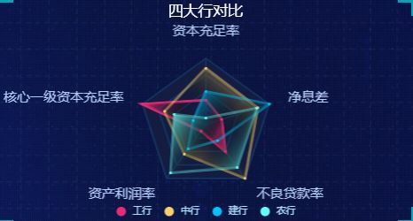

<h1>前端项目结构说明</h1>

<h2>目录结构</h2>

```javascript
src
│  App.vue					// 根组件
│  main.js					// 程序入口文件
│  README.md				// 结构说明
│  
├─assets
│  │  logo.png				// vue的logo
│  │  
│  ├─css 					//可能用到的css
│  │      swiper.min.css
│  │      visual.css
│  │      
│  ├─fonts					//导入的字体
│  │      DIGITALDREAMFAT.ttf
│  │      DIGITALDREAMFAT.woff
│  │      DIGITALDREAMFAT.woff2
│  │      yjsz.TTF
│  │      
│  ├─img
│  │  │  
│  │  ├─chart1				//可能用到的图片
│  │  │      
│  │  ├─chart2				//可能用到的图片
│  │  │      
│  │  ├─dynamic				//可能用到的图片
│  │  │      
│  │  └─screen_img			//Screen页面用到的图片
│  │          1.jpg			//背景图
│  │          head_bg.png	//页面头图
│  │          head_bg2.png	//页面头图
│  │          jt.png	 	//地球的边缘高亮图
│  │          lbx.png		//地球的边缘网结构图
│  │          lei.png		//雷天气图标
│  │          line.png		//组件边框的角
│  │          map.png		//地球图
│  │          qing.png		//晴天气图标
│  │          shachen.png	//沙尘天气图标
│  │          wu.png		//雾天气图标
│  │          xue.png		//雪天气图标
│  │          yin.png		//阴天气图标
│  │          yu.png		//雨天气图标
│  │          yun.png		//多云天气图标
│  │          
│  ├─js
│  │      request.js		//封装的请求类
│  │      utils.js			//封装的工具类
│  │      
│  └─styles
│          base.scss		//对浏览器的样式
│          common.scss		//公共样式
│          
├─components
│  │  index.js				//在此导入组件
│  │  
│  ├─colorfulRadar			//Home页面的雷达图组件
│  │      index.vue
│  │      
│  ├─dynamicLine			//Home页面的折线图组件
│  │      dynamicLine.vue
│  │      
│  ├─gauge					//Home页面的仪表盘组件
│  │      index.vue
│  │      
│  ├─HelloWorld				//根页面的初始vue项目界面
│  │      index.vue
│  │      
│  ├─leida					//Home页面的雷达图组件				
│  │      index.vue
│  │      
│  ├─ringPie				//Home页面的饼图组件
│  │      index.vue
│  │      
│  ├─Screen					//Screen页面的组件都在此
│  │      barChart.vue		//柱状图组件
│  │      dashboard.vue		//仪表盘组件
│  │      lineChart.vue		//折线图组件
│  │      list.vue			//列表组件
|  |      threeDashboards.vue //三雷达图组件
|  |      configChart.vue    //可配置组件
│  │      model.vue			//组件模型，可以复制内容稍做改动，来创建新组件
│  │      pieChart.vue		//饼图组件
│  │      radarChart.vue	//雷达图组件
│  │      waterSphereChart.vue	 //水球图组件
│  │      
│  └─seamless				//Home页面的动态信息组件
│          index.vue
│          
├─router					//路由，在此配置路径访问的页面
│      index.js
│      
├─store						//目前为空
│      index.js
│      
└─views						//两大页面
        Home.vue			//Home页面
        Screen.vue			//Screen页面
```

<h2>路径访问</h2>

访问Screen页面：

<http://localhost:8081/#/Screen>

<h2>界面展示</h2>

</img>

<h2>Screen页面html结构说明</h2>

</img>

</img>

<h2>风险指标</h2>

资本充足率=（核心资本+附属资本）/风险加权资产，不应低于8%

核心资本充足率=核心资本/风险加权资产，不应低于4%

资产利润率=税后净利润/平均资产总额*100%，不应低于0.6%

资本利润率=税后净利润/平均净资产*100%，不应低于11%

不良贷款率=不良贷款/贷款总额，不应高于5%

不良资产率=不良信用风险资产/信用风险资产总额 ，不应高于4%

流动性比例=流动性资产余额/流动性负债余额，不应低于25%

<h2>衡量银行的指标</h2>

风险加权资产收益率RORWA=归母净利润 / 期末风险加权资产 

<h2>数据图表定义说明</h2>

**三仪表盘**

表名：近年工行核心指标

值：资本充足率、核心资本充足率、核心一级资本充足率

轮播：2020年、2019年、2018年（未完成）

</img>

**柱状图**

表名：工行重要风险指标

X轴：比率

Y轴：各个风险指标

资产利润率、资本利润率、不良贷款率、不良资产率、流动性比例

</img>

**饼图**

表名：近年3年工行营业收入

分类：利息、投资收益、公允价值变动损益、汇总收益、手续费及佣金收入、其他业务收入

</img>

 

**折线图**

表名：2020年工行核心指标变化

X轴：今年的月份

Y轴：百分比

两条线：资本充足率与核心资本充足率

</img>

 

**雷达图**

表名：四大行对比

五个指标：资本充足率、核心一级资本充足率、资产利润率、不良贷款率、净息差

银行：工行、中行、建行、农行

</img>

 

**可配置 折线图**

 选项：工行、中行、建行、农行

 x轴：资本充足率、核心资本充足率、资产利润率

y轴：百分比

</img>


**可配置 雷达图**

 选项：工行、中行、建行、农行

 值：RORWA

</img>


**列表**

表名：17家全国性银行总资产规模

表头：公司、2019年资产值（万亿）、2020年资产值（万亿）、增幅、类型

</img>